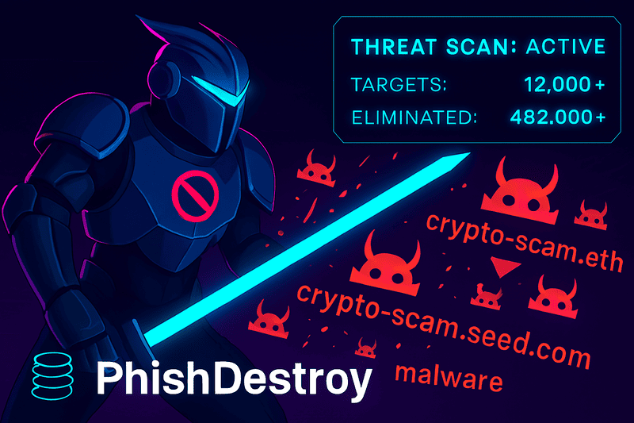

<h1 align="center" style="color:#00ffff;">🔒 PhishDestroy: Active Threat Neutralization</h1>

<em style="color:#cccccc">We don’t wait for threats. We obliterate them.</em>

  

  We scan, hunt, and destroy phishing infrastructure at scale. 
  Neutralized: <strong style="color:#ff4444">500,000+</strong> domains, <strong style="color:#ffaa00">25+</strong> networks, <strong style="color:#00ffff">15+</strong> actor cells. 
  <em>— We don’t block. We burn it all down.</em>

---

### <samp style="color:#00ffff">🚀 Operational Impact</samp>

- 💥 <strong>500,000+</strong> phishing domains neutralized
- 🕵️ <strong>15+</strong> full deanonymizations
- 🏴‍☠️ <strong>25+</strong> scam networks erased
- ⛓️ <strong>50+</strong> drainer teams dismantled

  
  

---

### <samp style="color:#00ffff">🔗 Real-Time Alerts</samp>

  
  
  

<strong>@PhishDestroyAlerts</strong>

---

### <samp style="color:#00ffff">🛡️ Operational Doctrine</samp>

| Phase        | Description                                                   | Status      |
|--------------|---------------------------------------------------------------|-------------|
| 🌐 SCAN      | Autonomous threat reconnaissance                              | ALWAYS-ON   |
| 🎯 HUNT      | Deep infrastructure analysis, asset correlation               | ACTIVE      |
| ⚡ STRIKE    | Registrar coordination, domain takedowns, IP null-routing     | RELENTLESS  |
| 🔥 ERASE     | Persistent infrastructure wipe, no return possible            | STANDARD    |

---

  
  
  
  
  
  
  
  
  
  
  
  
  
  
  
  
  
  
  
  

---

### <samp style="color:#00ffff">📊 GitHub Stats</samp>

  
  

---

### <samp style="color:#00ffff">🤝 Connect</samp>

  
  

---

<em style="color:#aaaaaa">Precision ops. No mercy. Full erasure.</em>

## 🤝 Contributing

We welcome:

💡 Ideas to improve detection/cleanup  
🔗 Better integration suggestions  
🛰️ New threat intel sources
